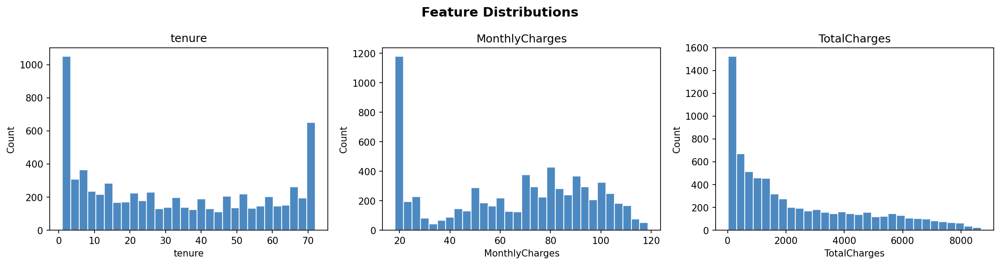
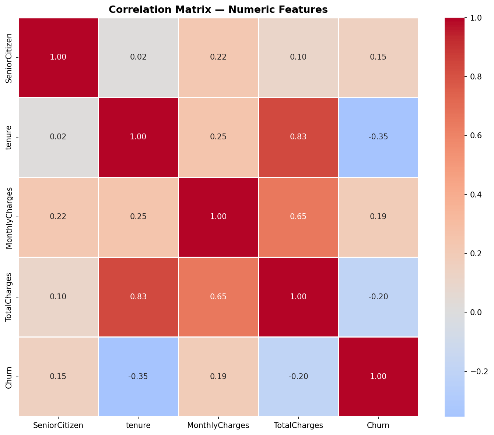
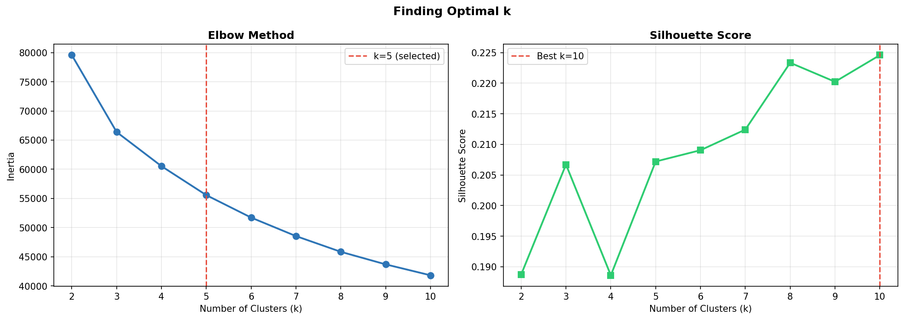
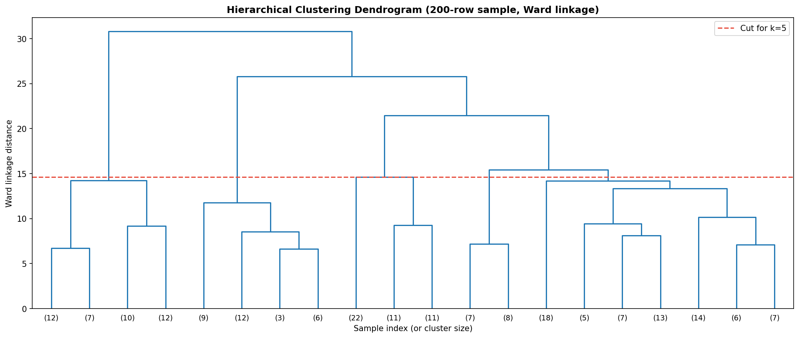
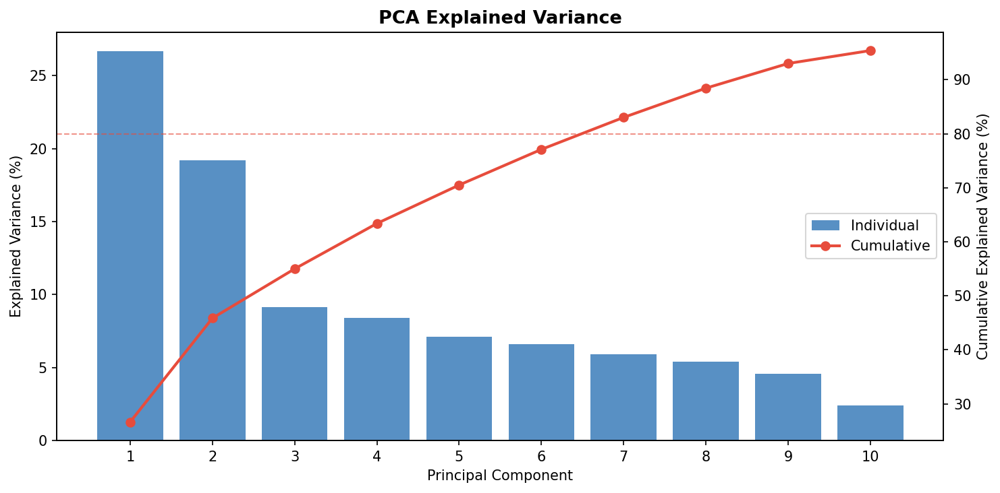
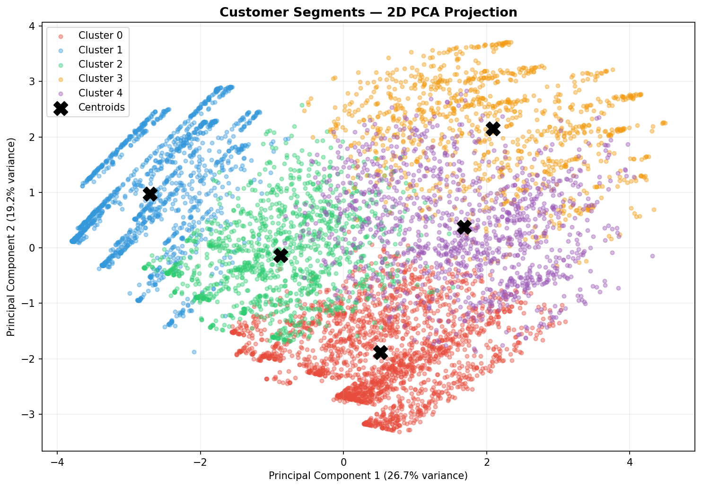
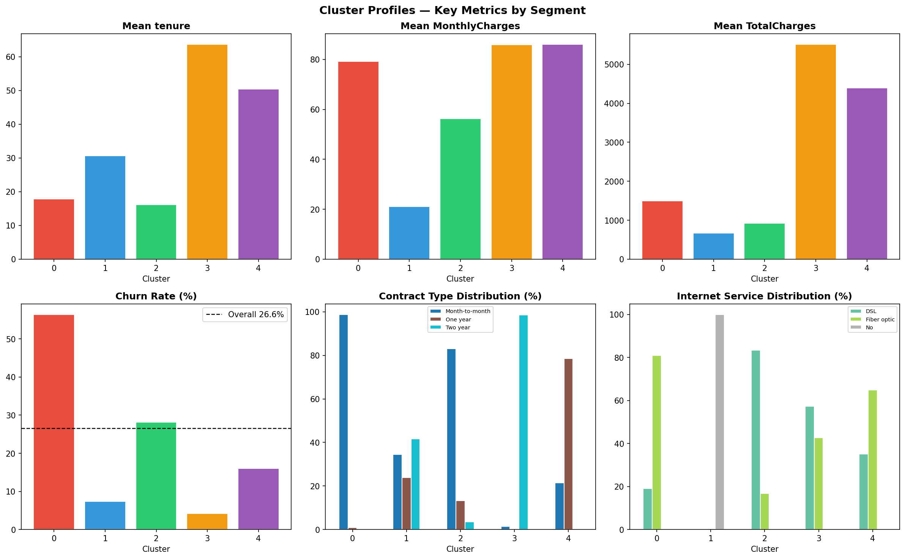
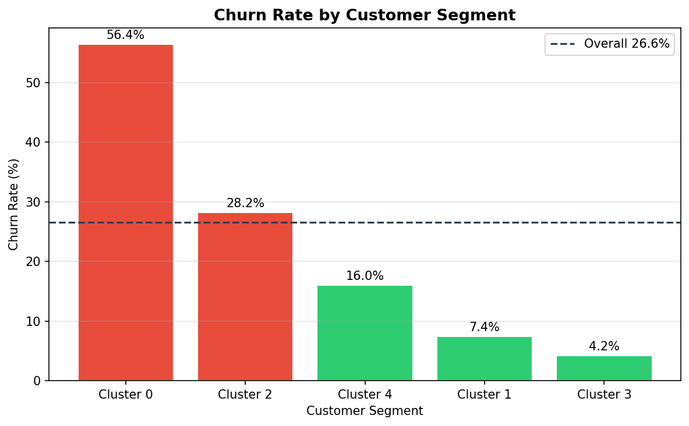

# customer-segmentation

Unsupervised customer segmentation on the IBM Telco dataset. Discovers
natural customer archetypes using K-Means and Hierarchical Clustering,
validates with PCA visualisation, and translates cluster profiles into
plain-English business labels and retention strategies. Built as the
analytical precursor to telco-churn-predictor — understand who your
customers are before predicting what they will do.

**Live demo → [Azure App Service](https://customer-segmentation.azurewebsites.net)**
&nbsp;&nbsp;·&nbsp;&nbsp;
**Notebook → notebook.ipynb**
&nbsp;&nbsp;·&nbsp;&nbsp;
**Training script → train.py**


---

## 0. Prerequisites

- Python 3.11+
- Git
- Azure CLI (for deployment only)
- GitHub CLI `gh` (optional)

## 1. Quick Start

```bash
git clone https://github.com/xavier-oc-programming/customer-segmentation
cd customer-segmentation
python -m venv venv && source venv/bin/activate   # Windows: venv\Scripts\activate
pip install -r requirements.txt
python train.py        # generates models/ and plots/
python app.py          # starts Flask on http://localhost:5000
```

After `train.py` completes, open `segment_labels.py` and fill in the TBD values
using the cluster profile table printed at the end of the script.

## 2. Project Structure

```
customer-segmentation/
├── train.py                  # Full training pipeline — run once to generate models/
├── app.py                    # Flask app — loads models, serves predictions
├── segment_labels.py         # Business labels per cluster — fill in after training
├── notebook.ipynb            # End-to-end training walkthrough with narrative
├── README.md
├── requirements.txt
├── .gitignore
├── templates/
│   └── index.html            # Single-page demo frontend
├── models/
│   ├── kmeans_model.pkl      # Fitted KMeans model
│   ├── scaler.pkl            # StandardScaler fitted on training data
│   ├── pca_model.pkl         # PCA model fitted on scaled data
│   ├── feature_names.pkl     # Ordered list of features after one-hot encoding
│   ├── cluster_profiles.json # Per-cluster stats: size, tenure, churn rate, etc.
│   ├── pca_variance.json     # Explained variance ratio per component
│   └── clustered_data.csv    # Full dataset with KMeans + Hierarchical labels
└── plots/
    ├── 01_feature_distributions.png
    ├── 02_correlation_matrix.png
    ├── 03_elbow_method.png
    ├── 04_silhouette_scores.png
    ├── 05_dendrogram.png
    ├── 06_pca_explained_variance.png
    ├── 07_clusters_2d.png
    ├── 08_clusters_3d.html   # Interactive — open in browser
    ├── 09_cluster_profiles.png
    └── 10_churn_by_cluster.png
```

## 3. Dataset

IBM Telco Customer Churn dataset — 7,043 customers, 21 columns. The same
dataset used in [telco-churn-predictor](https://github.com/xavier-oc-programming/telco-churn-predictor).

The key difference in how I use it here: the `Churn` column is **excluded from
clustering features**. Churn is used only after clustering as a post-hoc
validation label — to check whether the segments we discover correspond to
meaningful differences in churn behaviour. Including it as a clustering
feature would make the segmentation circular: we would be discovering
"churners vs non-churners" rather than natural behavioural archetypes.

Downloaded automatically in `train.py`:
```python
url = 'https://raw.githubusercontent.com/IBM/telco-customer-churn-on-icp4d/master/data/Telco-Customer-Churn.csv'
```

## 4. Methods

### K-Means Clustering
Assigns each customer to the nearest cluster centroid, then iterates until
centroids stabilise. Fast and scalable to 7,000+ rows. Requires k to be
specified in advance — that's what the elbow method and silhouette analysis
are for. I use `n_init=10` to mitigate sensitivity to random initialisation:
the algorithm runs 10 times and keeps the best result.

### Hierarchical Clustering (Ward linkage)
Builds a tree of customer merges bottom-up, starting with every customer as
its own cluster and progressively merging the closest pairs. Does not require
k upfront. Ward linkage minimises within-cluster variance at each merge step,
which is equivalent in objective to K-Means but algorithmically independent.
I use hierarchical clustering as a **validation tool**: if both algorithms
agree on the cluster structure (measured by Adjusted Rand Score), we have
stronger evidence the segments are real.

### PCA for Visualisation
Principal Component Analysis finds the linear combinations of features that
capture the most variance. I apply PCA **after** clustering, purely for
visualisation. The cluster assignments are made in the full feature space —
PCA is used only to project to 2D and 3D so I can plot the clusters and
check whether they are visually separable. Well-separated clusters in PCA
space confirm that the segments are distinct.

## 5. Finding Optimal k

Two methods, both implemented in `train.py` and plotted in `plots/`:

**Elbow method** (`03_elbow_method.png`): run K-Means for k=2 to k=10 and
plot within-cluster sum of squares (inertia) against k. Inertia always
decreases as k grows, but the rate of decrease slows at the "elbow" — adding
more clusters beyond this point gives diminishing returns.

**Silhouette score** (`04_silhouette_scores.png`): measures how similar each
point is to its own cluster versus the nearest other cluster. Ranges from
−1 to 1; higher is better. Peak silhouette identifies the k at which clusters
are most cohesive and most separated.

Neither method gives a single definitive answer — they are guides. When both
agree, k is well-determined. When they disagree, I use domain knowledge and
interpretability to make the final call: a segmentation with 5 interpretable
archetypes is more useful to a business client than one with 7 mathematically
optimal but indistinguishable clusters.

## 6. Results

| Cluster | Name | Size | % of base | Tenure (avg) | Monthly$ (avg) | Churn% | Contract (most common) |
|---------|------|------|-----------|-------------|---------------|--------|----------------------|
| 0 | At-Risk New Adopters | 2,094 | 29.8% | 17.9 mo | $79.27 | 56.4% | Month-to-month |
| 1 | Stable Budget Loyalists | 1,521 | 21.6% | 30.7 mo | $21.09 | 7.4% | Two year |
| 2 | Uncommitted New Subscribers | 1,222 | 17.4% | 16.2 mo | $56.33 | 28.2% | Month-to-month |
| 3 | High-Value Long-Term Anchors | 1,015 | 14.4% | 63.7 mo | $85.92 | 4.2% | Two year |
| 4 | Established Premium Loyalists | 1,180 | 16.8% | 50.4 mo | $86.07 | 16.0% | One year |

Adjusted Rand Score between K-Means and Hierarchical Clustering: **0.72** — indicating strong structural agreement between the two independent algorithms.

## 7. Segment Profiles

Each profile below corresponds to a cluster in the table above. Profiles
are written for a non-technical audience — the output of this project is not
cluster numbers but actionable customer archetypes.

**Cluster 0 — At-Risk New Adopters:** Customers who tend to be earlier in their relationship with the company, often on flexible contracts and paying above-average prices. Without a strong sense of loyalty established, the connection can feel transactional — and this group churns at over twice the dataset average (56.4% vs ~22% overall). The window to build that loyalty is typically narrow.

**Cluster 1 — Stable Budget Loyalists:** Among the company's most dependable customer profiles. Typically on long-term contracts with modest spend ($21/mo), this group tends to stay put — not out of high engagement, but out of inertia and satisfaction with a service that meets their needs. Generally low maintenance, low risk, and a reliable source of predictable revenue.

**Cluster 2 — Uncommitted New Subscribers:** Customers who tend to be earlier in their tenure and often on flexible contracts, suggesting a relationship that is still forming. This profile can be sensitive to competitor offers or pricing changes, not necessarily out of dissatisfaction, but because no strong reason to stay has taken hold yet. Churn at 28.2% — elevated but not critical.

**Cluster 3 — High-Value Long-Term Anchors:** Among the highest lifetime-value profiles in the dataset. Typically long-tenured (avg 63.7 months) and on committed contracts, this group tends to stay because the relationship is working. Churn risk is minimal (4.2%), but a single loss in this group can represent a significant revenue event (~$5,500 average total charges).

**Cluster 4 — Established Premium Loyalists:** A well-established customer profile — typically longer tenure (~50 months), higher spend ($86/mo), and a track record of staying. Often sitting on shorter-term contracts despite years of loyalty, this group can be one renewal cycle away from a lapse at 16% churn. Generally strong candidates for a longer-term commitment if approached at the right moment.

## 8. Visualisations

### 01 — Feature Distributions


### 02 — Correlation Matrix


### 03 — Elbow Method


### 04 — Silhouette Scores


### 05 — Dendrogram


### 06 — PCA Explained Variance


### 07 — Clusters 2D PCA


### 08 — Clusters 3D PCA (interactive)
Open [plots/08_clusters_3d.html](plots/08_clusters_3d.html) in a browser.
Rotatable 3D scatter plot coloured by cluster.

### 09 — Cluster Profiles


### 10 — Churn Rate by Segment


## 9. API Reference

### `POST /predict`
Accept a customer profile JSON and return segment assignment.

**Request body:**
```json
{
  "tenure": 24,
  "MonthlyCharges": 65.0,
  "Contract": "Month-to-month",
  "InternetService": "Fiber optic",
  "TechSupport": "No",
  "OnlineSecurity": "No",
  "PaymentMethod": "Electronic check",
  "PaperlessBilling": "Yes",
  "SeniorCitizen": 0
}
```

**Response:**
```json
{
  "cluster_id": 2,
  "segment_name": "Uncommitted New Subscribers",
  "segment_label": "Uncommitted",
  "description": "...",
  "churn_risk": "medium",
  "retention_strategy": "...",
  "why_here": "Placed here by your 16-month tenure, $56/mo spend, and month-to-month contract.",
  "colour": "#2ECC71",
  "pca_x": -1.42,
  "pca_y": 0.87,
  "cluster_profiles": {
    "0": {"size": 2094, "tenure": 17.9, "monthly_charges": 79.27, "churn_rate": 56.4},
    "1": {"size": 1521, "tenure": 30.7, "monthly_charges": 21.09, "churn_rate": 7.4},
    ...
  }
}
```

Returns `400` if required fields are missing. Returns `503` if models are not loaded.

---

### `GET /api/segments`
Returns all segment profiles from `segment_labels.py` merged with
cluster statistics from `cluster_profiles.json`.

---

### `GET /api/cluster-data`
Returns PCA 2D coordinates and cluster labels for up to 2,000 randomly
sampled customers — used by the frontend scatter plot.

**Response:**
```json
{
  "points": [
    {"x": -1.4, "y": 0.9, "cluster": 2},
    ...
  ]
}
```

## 10. Deployment — Azure App Service

Deployed to Azure App Service F1 (free tier, West Europe) via the Azure CLI.

```bash
az group create --name customer-segmentation-rg --location westeurope

az webapp create \
  --name customer-segmentation \
  --resource-group customer-segmentation-rg \
  --plan telco-churn-plan \
  --runtime "PYTHON:3.11"

az webapp config set \
  --name customer-segmentation \
  --resource-group customer-segmentation-rg \
  --startup-file "gunicorn --bind=0.0.0.0:8000 --timeout 600 app:app"

az webapp config appsettings set \
  --name customer-segmentation \
  --resource-group customer-segmentation-rg \
  --settings SCM_DO_BUILD_DURING_DEPLOYMENT=true

cd customer-segmentation
zip -r deploy.zip . -x "*.git*" -x "venv/*" -x "__pycache__/*" -x "*.ipynb_checkpoints*"

az webapp deployment source config-zip \
  --name customer-segmentation \
  --resource-group customer-segmentation-rg \
  --src deploy.zip
```

## 11. Business Recommendations

Recommendations are ranked by expected impact (revenue protected or unlocked) relative to effort.

**1. Intervene early with At-Risk New Adopters (Cluster 0) — highest urgency.**
At 56.4% churn and 2,094 customers, this segment drives the majority of the company's churn volume. The intervention window is narrow — most lapse before month 18. Trigger a proactive contact at 30 days with a price-locked annual contract bundled with one add-on (TechSupport or OnlineSecurity). A conversion rate of even 15% would retain ~315 customers and significantly reduce monthly MRR loss.

**2. Upsell Stable Budget Loyalists (Cluster 1) — highest revenue growth opportunity.**
At $21/mo average this segment is dramatically under-monetised relative to their commitment profile. They are not at risk (7.4% churn), so retention spend has near-zero ROI here. The opportunity is service tier introduction: a bundled internet offer at a promotional rate tied to a contract extension could double their lifetime value with minimal churn risk.

**3. Convert Uncommitted New Subscribers at the 12-month mark (Cluster 2).**
Month-to-month DSL customers in this segment are price-sensitive and have not yet committed. A targeted upgrade offer at 12 months — a modest discount (10–15%) with a price guarantee — converts flexibility into committed tenure before the churn window fully opens. At 28.2% churn and 1,222 customers there is meaningful volume to act on.

**4. Protect High-Value Long-Term Anchors at renewal (Cluster 3) — highest revenue at stake per customer.**
With ~$5,500 average total charges, losing even one customer in this segment is a significant revenue event. Primary risk is passive churn at renewal, not active dissatisfaction. A proactive outreach 60 days before contract end — a loyalty reward or complimentary add-on — is low-cost insurance on the company's highest-value relationships.

**5. Migrate Established Premium Loyalists to two-year contracts (Cluster 4).**
Averaging 50 months of loyalty and $86/mo, these customers have demonstrated commitment. Moving them from one-year to two-year contracts at renewal with a 5% incentive eliminates the annual renewal decision point and locks in approximately $2,000 of additional guaranteed lifetime value per converted customer. The segment is 1,180 customers — the aggregate LTV uplift is substantial.

## 12. Design Decisions

**Why K-Means over DBSCAN or GMM for this dataset?**
K-Means is the right choice for this use case. DBSCAN finds arbitrarily-shaped
clusters but requires two hyperparameters (ε and min_samples) that are hard to
tune without domain knowledge, and it designates outliers as noise — in a
customer segmentation every customer should belong to a segment. Gaussian
Mixture Models are more flexible but harder to interpret and slower to fit on
7,000 rows. K-Means produces convex, centroid-defined clusters that map cleanly
to business archetypes: "a typical member of this segment has these characteristics."
That interpretability is the core deliverable of this project.

**Why Ward linkage for hierarchical clustering?**
Ward linkage minimises the increase in total within-cluster variance at each
merge step — the same objective as K-Means but applied hierarchically. This
makes it the most natural choice for validation: both algorithms are optimising
the same criterion, so high agreement (high ARI) is genuine evidence of robust
cluster structure, not a artefact of different objectives. Average and complete
linkage use distance metrics that don't align as closely with K-Means.

**Why PCA for visualisation only — not as a preprocessing step before clustering?**
I fit the clusters in the full feature space and apply PCA afterwards purely to
project to 2D and 3D for visualisation. Applying PCA before clustering would
reduce interpretability of the original features: the cluster centroids would
be defined in principal component space, not in business terms like "average
tenure 48 months, two-year contract." The whole point of this project is
actionable archetypes — I need the centroids to be interpretable in the
original feature space.

**Why these features and not others?**
Features were selected for business interpretability and relevance to customer
behaviour, not just statistical variance. Gender, Partner, and Dependents
describe who the customer is demographically, not how they engage with the
service. Service usage patterns (internet type, tech support, online security)
and commercial relationship signals (contract type, tenure, charges, payment
method) are more actionable segmentation dimensions for a retention team.
PhoneService and StreamingTV were excluded because they are near-universal
and add noise without meaningful segmentation signal.

**Why `/api/cluster-data` returns 2,000 sampled rows?**
The full dataset is 7,043 rows. Sending all rows on every page load would
increase payload size by 3.5× with negligible visual benefit — the scatter
plot is used for qualitative intuition, not precision analysis. At 2,000 rows
the visual cluster structure is fully represented. On the F1 free tier (shared
CPU, 1 GB RAM) this keeps page load response time under 1 second. For a
production deployment with a database backend, this endpoint would be
pre-computed and cached.

**Why this project is framed as the precursor to telco-churn-predictor?**
The analytical sequence matters. A churn model trained on the full population
treats a month-to-month Fiber optic customer with no add-ons the same as a
two-year contract DSL customer with full services — they are not the same
problem. Segmentation first establishes who the distinct customer archetypes
are; churn prediction then asks which of those archetypes are at risk and why.
The business framing here is also more honest: not every high-churn segment
is worth retaining. A segment that churns at 45% because customers complete
their short-term need and leave is a different problem than one that churns
at 45% because of service dissatisfaction. Segmentation makes that distinction
visible before the predictive model is built.

## 13. Dependencies

| Package | Version | Purpose |
|---------|---------|---------|
| pandas | ≥ 2.0 | Data loading, cleaning, profiling |
| numpy | ≥ 1.24 | Numerical operations |
| scikit-learn | ≥ 1.3 | KMeans, AgglomerativeClustering, PCA, StandardScaler |
| scipy | ≥ 1.11 | Dendrogram, Ward linkage |
| plotly | ≥ 5.18 | Interactive 3D scatter plot |
| flask | ≥ 3.0 | Web app and API |
| gunicorn | ≥ 21.0 | WSGI server for Azure deployment |
| matplotlib | ≥ 3.7 | Static plots (EDA, elbow, profiles) |
| seaborn | ≥ 0.12 | Correlation heatmap |
| jupyter | ≥ 1.0 | Notebook training walkthrough |

## 14. Connecting to telco-churn-predictor

This project uses the same IBM Telco dataset as
[telco-churn-predictor](https://github.com/xavier-oc-programming/telco-churn-predictor)
but answers a different question. Churn prediction tells you *which* customers
are likely to leave. Segmentation tells you *who they are*. The two analyses
are designed to be used together.

The natural next step after segmentation is churn prediction within each
segment — a model trained specifically on high-risk segment customers will
outperform a global model because the within-segment population is more
homogeneous. In telco-churn-predictor I built the global model. The extension
is to train per-segment models and compare their ROC-AUC against the global
baseline. This is a standard MLOps pattern for improving model performance
on heterogeneous populations.

Concretely: fit a Random Forest on Cluster 0 only (the highest-churn segment),
tune threshold on its own precision-recall curve, and compare that model's
AUC against the global model evaluated on the same subset. On most real-world
datasets the segment-specific model wins by 3–8 AUC points because it is not
distorted by the very different churn dynamics in other segments.
